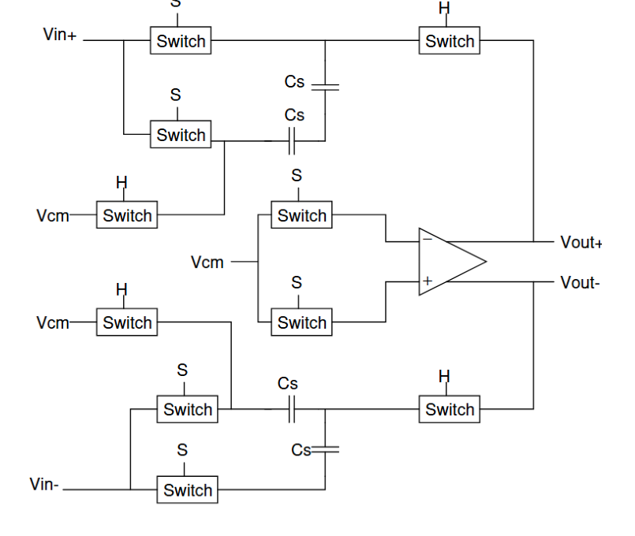
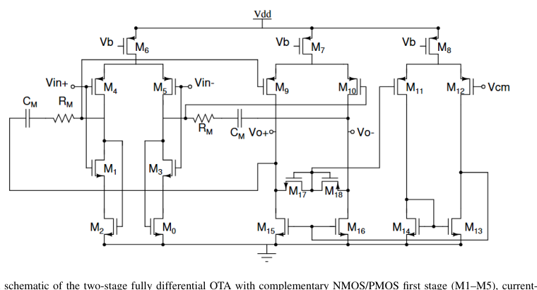
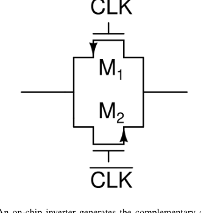
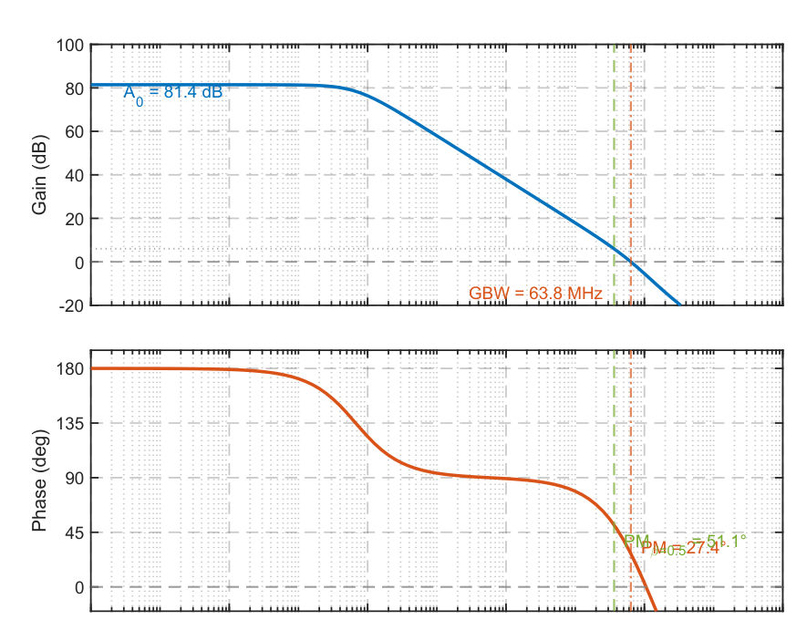
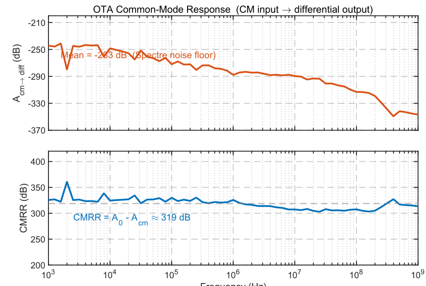
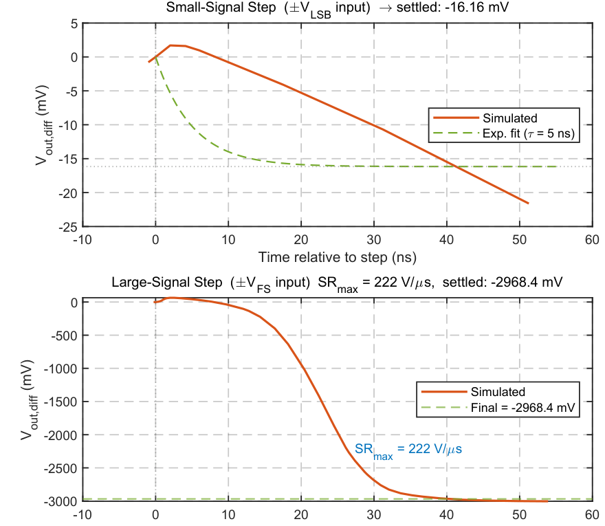
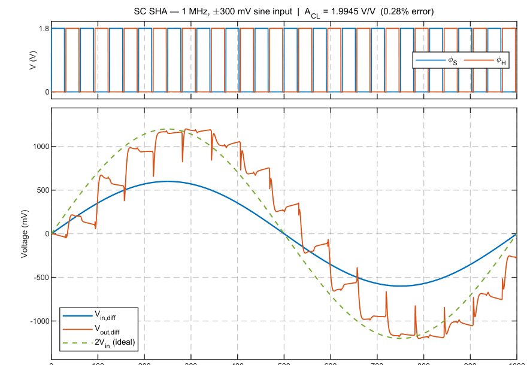
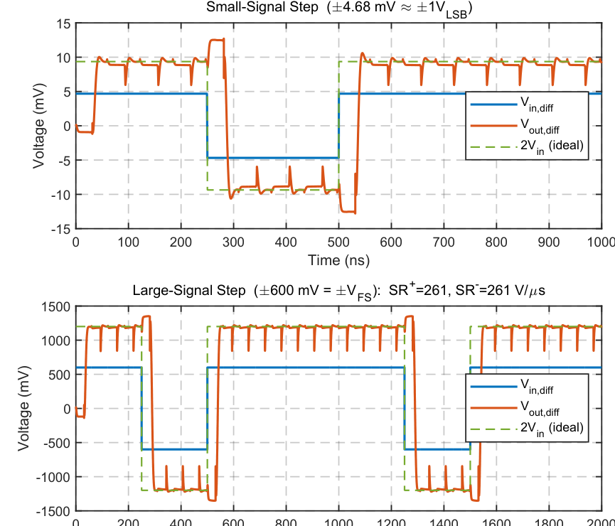
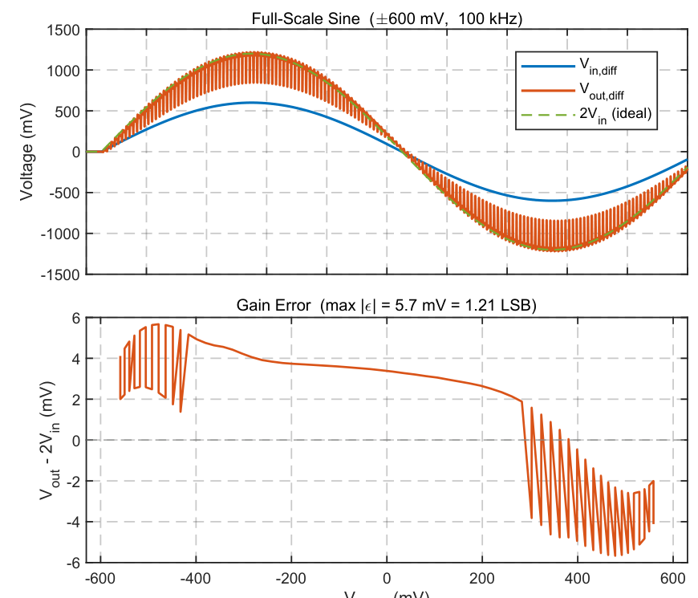

<!--
Report Editing Notes

Structure:
- Keep the report in this order: title/author block, Abstract, numbered main
  sections, references.
- Use Markdown headings for section hierarchy:
  - `## I. Section Name` for major sections.
  - `### A. Subsection Name` for subsections.
- Keep equations and formula snippets in fenced `text` code blocks when plain
  Markdown is clearer than LaTeX.
- Keep measurement summary tables as Markdown tables.

Package / asset layout:
- Report source: `ADC_Project_Report.md`.
- Original submission PDF: `ELEN312_Submission/docs/elen6312_submission.pdf`.
- Figure assets: `figures/`.
- Every image path should be relative, for example
  `figures/fig01-top-level-schematic.png`.
- Figure filenames use the pattern `figNN-short-description.png`, matching the
  order of appearance in the report.

Figure style:
- Every figure uses a centered HTML wrapper:
  `<div align="center">`
  `<br>`
  `<em>Fig. N. Caption text.</em>`
  `</div>`
- Change the number in `width="420"` beside each figure to resize that figure
  only.
- Do not set image height manually; GitHub keeps the original width/height ratio
  when only `width` is set.

Layout style:
- Use GitHub-compatible HTML attributes instead of a `<style>` block, because
  GitHub Markdown sanitizes most custom CSS.
- Figures and captions are centered; captions are italicized with plain HTML.
-->

# Design of a Fully Differential Switched-Capacitor Sample-and-Hold Amplifier for a 16-MHz, 7-Bit Pipelined ADC

Yi-Hsiang Wei, Chun-Chi Lu, Zijian Shang  
Students, Department of Electrical Engineering, Columbia University, New York, NY 10027

## Abstract

A fully differential switched-capacitor (SC) sample-and-hold amplifier (SHA) with a nominal gain of 2 is designed for the residue-amplification stage of a 1.5-bit/stage pipelined analog-to-digital converter (ADC). The design targets `fs = 16 MHz` and `N = 7 bits` resolution under a 1.8 V supply in the TSMC 180 nm CMOS process. The operational transconductance amplifier (OTA) employs a two-stage Miller-compensated topology with a complementary NMOS/PMOS first stage, yielding a DC gain of 81.44 dB, a unity-gain bandwidth of 63.78 MHz, and a phase margin of 51.1 degrees at the feedback factor `beta = 0.5` of the SC circuit. Four matched 200 fF capacitors implement the gain-of-2 charge-redistribution function with a 44x margin against the `kT/C` noise budget. A slew rate of 261 V/us is extracted from large-signal step-response simulation. The measured closed-loop gain is 1.9945 V/V (0.28% error), and the peak gain error over the full input range is 5.67 mV (1.2 VLSB), confirming 7-bit linearity. Total power consumption is 438.5 uW, yielding a Walden FOM of 214 fJ/step.

**Index Terms:** switched-capacitor amplifier, pipelined ADC, residue amplifier, Miller compensation, complementary OTA, common-mode feedback, TSMC 180 nm.

## I. Introduction

Pipelined analog-to-digital converters achieve high throughput by parallelising the conversion across successive stages, each performing a coarse sub-decision and amplifying the residue voltage for the next stage [1], [2]. In a 1.5-bit-per-stage architecture the residue is

```text
vout = 2 * (vin - X * VREF / 2),       X in {-1, 0, +1}.       (1)
```

The gain-of-2 amplification in (1) must be accurate to the full ADC resolution; a 1/2-LSB gain error at the first stage degrades the overall linearity by a full bit.

A fully differential switched-capacitor implementation is standard because it rejects supply noise, clock feedthrough, and even-order nonlinearity to first order [3]. The design challenge is to meet the gain accuracy, settling speed, and thermal noise requirements while minimising power.

This paper presents the complete transistor-level design of a fully differential SC SHA with the target specifications listed in Table I. Section II covers system-level parameter selection. Section III presents the OTA design. Section IV describes the complete SC amplifier and simulation results. Section V gives the performance summary and figure of merit.

## II. System-Level Design

### A. Parameter Selection

The selected design parameters are summarised in Table I. A sampling frequency of `fs = 16 MHz` was chosen as the highest available speed point, and a 7-bit ADC resolution was selected to establish a moderate noise budget while challenging the settling requirement. The full-scale differential amplitude is `VFS = +/-300 mV` under a 1.8 V supply, keeping adequate headroom for the OTA output transistors. The input and output common-mode voltage is `VCM = 0.9 V`. The LSB voltage is

```text
VLSB = 2VFS / 2^N = 600 mV / 2^7 = 4.6875 mV.                 (2)
```

**Table I. System Design Parameters**

| Parameter | Value |
|---|---:|
| Supply voltage `VDD` | 1.8 V |
| Common-mode `VCM` | 0.9 V |
| OTA bias `Vb` | 0.6 V |
| Sampling frequency `fs` | 16 MHz |
| ADC resolution `N` | 7 bits |
| Full-scale `VFS` | +/-300 mV differential |
| `VLSB` | 4.6875 mV |
| Feedback factor `beta` | 0.50 |
| Process / corner | TSMC 180 nm / tt |
| Temperature | 300 K (27 degrees C) |

### B. Thermal Noise and Capacitor Sizing

The mean-square `kT/C` noise sampled onto each capacitor is

```text
Vn^2 = kT / Cs.                                                (3)
```

To keep noise below half a quantisation step the constraint is

```text
kT / Cs < VLSB^2 / 24,                                         (4)
```

where the factor of 24 combines the fully differential noise addition and the uniform quantisation model. Solving (4):

```text
Cs,min = 24kT / VLSB^2
       = 24 * 1.381e-23 * 300 / (4.6875e-3)^2
       ~= 4.5 fF.                                               (5)
```

A value of `Cs = 200 fF` was chosen, giving a calculated noise of `sqrt(kT/Cs) = 144 uVrms` and a 44x power margin over the budget (`kT/C = 2.07e-8 V^2` vs. budget `9.15e-7 V^2`). This margin protects against OTA input-referred noise and process variation.

### C. SC Gain Analysis

Fig. 1 shows the fully differential SC SHA. Each differential half uses two capacitors: `Cf = Cs = 200 fF`. During the sampling phase (`phiS` active) both `Cf` and `Cs` on each half charge to the input minus `VCM`, while the OTA inputs are shorted to `VCM`:

```text
Qsamp = (Cf + Cs)(Vin - VCM).                                  (6)
```

During the hold phase (`phiH` active), `Cf` connects from the OTA output to the OTA input as feedback, while the `Cs` top plate connects to `VCM`. With virtual ground at the OTA input, charge conservation gives

```text
A = (Vout - VCM) / (Vin - VCM)
  = (Cf + Cs) / Cf
  = (200 + 200) / 200
  = 2,                                                          (7)
```

confirming the required gain of 2 regardless of capacitor absolute value, depending only on the ratio `Cs/Cf = 1`.

<div align="center">
<br>
<em>Fig. 1. Top-level schematic of the fully differential switched-capacitor sample-and-hold amplifier. Switches labelled phiS close during the sampling phase; switches labelled phiH close during the hold phase. Four 200 fF capacitors implement the gain-of-2 charge-redistribution function.</em>
</div>

### D. Switch Design and Settling Budget

CMOS transmission gates are used so that the on-resistance is low and signal-independent across the full common-mode range. The feedback factor seen by the OTA during the hold phase is `beta = Cf/(Cf + Cs) = 0.5`. For 7-bit linear settling in a half period `Thalf = 31.25 ns`, the required OTA unity-gain bandwidth is

```text
GBW >= N ln(2) / (2 pi beta Thalf)
    = 7 * 0.693 / (2 pi * 0.5 * 31.25 ns)
    ~= 50 MHz.                                                  (8)
```

The minimum DC gain for gain error below `VLSB/2` is `A0 > 2^(N+1)/beta = 512 (>54 dB)`. The OTA achieves `GBW = 63.78 MHz` and `A0 = 81.44 dB`, both comfortably exceeding these requirements.

**Table IV. Switch Transistor Sizes**

| Device | Type | W (um) | L (um) | m |
|---|---|---:|---:|---:|
| M8 (pass) | NMOS | 1 | 0.18 | 1 |
| M9 (pass) | PMOS | 1 | 0.18 | 2 |
| M21 (inv) | NMOS | 1 | 0.18 | 1 |
| M20 (inv) | PMOS | 1 | 0.18 | 2 |

## III. OTA Design

### A. Topology

A two-stage fully differential OTA with Miller compensation was selected for its ability to deliver high DC gain and high output swing independently in each stage, and for its straightforward common-mode-feedback integration [3].

<div align="center">
<br>
<em>Fig. 2. Transistor-level schematic of the two-stage fully differential OTA with complementary NMOS/PMOS first stage, current-recycling tail pair, PMOS second-stage output pair, and CMFB circuit. Miller compensation uses Rz = 2 kOhm and Cc = 315 fF.</em>
</div>

<div align="center">
<br>
<em>Fig. 3. CMOS transmission-gate switch schematic. An on-chip inverter generates the complementary clock. NMOS and PMOS pass transistors operate in complementary regions to provide low, signal-independent on-resistance across the full input range.</em>
</div>

### B. First Stage: Complementary Differential Pair

The first stage employs a complementary differential pair. NMOS transistors M1/M3 (`W/L = 1 um / 720 nm`, `m = 1`) and PMOS transistors M4/M5 (`W/L = 1 um / 1.44 um`, `m = 4`) both receive the differential input and drive the same intermediate output nodes. The effective first-stage transconductance is

```text
Gm1 = gm,n + gm,p,                                               (9)
```

doubling the transconductance per unit tail current compared with a single-type pair and thereby reducing the required bias current for a given GBW target.

Cross-coupled NMOS transistors M0/M2 (`W/L = 1 um / 1.44 um`, `m = 1`), whose gates are tied to the complementary first-stage outputs and whose drains connect to the NMOS tail node, implement adaptive current recycling that further boosts `Gm1` and stabilises the operating point. Long gate lengths (`4Lmin` to `8Lmin`) are used throughout the first stage to raise `ro` and hence the first-stage gain `A1 = Gm1Ro1`.

### C. Second Stage and Miller Compensation

The second stage uses PMOS common-source transistors M9/M10 (`Weff = 16 um`, `L = 1.44 um`) loaded by NMOS current sources M15/M16 (`Weff = 8 um`, `L = 1.44 um`). Long gate lengths again maximise `ro` for high second-stage gain `A2 = gm2(ro9 || ro15)`.

Miller compensation is applied with `Cc = 315 fF` capacitors connected from each first-stage output to the corresponding second-stage output. A zero-cancellation resistor `Rz = 2 kOhm` in series with each `Cc` eliminates the right-half-plane zero, improving phase margin. The unity-gain bandwidth is

```text
GBW = Gm1 / (2 pi Cc).                                          (10)
```

All transistor sizes are listed in Table II and passive component values in Table III.

**Table II. OTA Transistor Sizes (`Wu = 1 um`, `m = multiplier`)**

| Device | Type | Wu (um) | L (um) | m | Role |
|---|---|---:|---:|---:|---|
| M1, M3 | NMOS | 1 | 0.72 | 1 | 1st-stage NMOS diff pair |
| M0, M2 | NMOS | 1 | 1.44 | 1 | NMOS tail regulation |
| M4, M5 | PMOS | 1 | 1.44 | 4 | 1st-stage PMOS diff pair |
| M6 | PMOS | 1 | 0.18 | 32 | 1st-stage PMOS tail |
| M7 | PMOS | 1 | 0.18 | 32 | 2nd-stage PMOS tail |
| M8 | PMOS | 1 | 0.18 | 4 | CMFB tail |
| M9, M10 | PMOS | 1 | 1.44 | 16 | 2nd-stage output PMOS |
| M11, M12 | PMOS | 1 | 0.18 | 2 | CMFB sense pair |
| M13, M14 | NMOS | 1 | 0.18 | 1 | CMFB current mirror |
| M15, M16 | NMOS | 1 | 1.44 | 8 | 2nd-stage NMOS load |
| M17, M18 | NMOS | 1 | 0.72 | 1 | Output CM sense |

**Table III. Passive Component Values**

| Component | Value |
|---|---:|
| Miller capacitor `Cc` (per side, OTA internal) | 315 fF |
| Zero-cancellation resistor `Rz` (per side) | 2 kOhm |
| Feedback/sampling capacitors `Cf = Cs` (per side) | 200 fF |

### D. Common-Mode Feedback

The CMFB circuit senses the output common-mode voltage and adjusts the second-stage NMOS load bias to maintain `Vout,CM = VCM`. Diode-connected NMOS transistors M17/M18 produce a common node whose voltage tracks `(Vout+ + Vout-)/2 - VGS`. PMOS pair M11/M12 compares this node against `VCM`; the amplified error is mirrored by M13/M14 to the second-stage NMOS load transistors M15/M16 to close the CMFB loop. The CMFB tail is sized for a bandwidth well above the signal bandwidth to ensure common-mode stability without degrading differential settling.

## IV. SC Amplifier Integration and Simulation

### A. Clock Timing

A non-overlapping two-phase clock is generated externally. The sampling clock `phiS` has pulse width 28 ns starting at `t = 0`. The hold clock `phiH` is shifted by `Ts/2 = 31.25 ns` with the same 28 ns pulse width. The dead band of approximately 3.25 ns at each edge prevents charge sharing between phases.

### B. OTA Differential Frequency Response

Fig. 4 shows the simulated differential open-loop gain and phase of the OTA. The DC gain is `A0 = 81.44 dB` (about 11,800 V/V), the unity-gain bandwidth is `GBW = 63.78 MHz`, and the phase margin at GBW is 27.4 degrees for a unity-feedback configuration. For the SC circuit with `beta = 0.5`, the relevant gain crossover occurs at `f6dB = 36.52 MHz`, where the phase margin is 51.1 degrees, adequate for well-damped settling.

The closed-loop time constant at `beta = 0.5` is

```text
tau_cl = 1 / (2 pi f_-3dB)
       = 1 / (2 pi * 63.78 MHz * 0.5)
       ~= 5.0 ns.                                               (11)
```

Seven-bit linear settling requires `N ln(2) * tau_cl = 24.3 ns`. Adding a slew time of approximately 2.5 ns for a full-scale step, the total settling demand of approximately 26.8 ns fits within the 31.25 ns half-period with a 14% margin.

<div align="center">
<br>
<em>Fig. 4. Simulated differential open-loop frequency response of the OTA. Top: magnitude. Bottom: phase. The DC gain is 81.44 dB, GBW is 63.78 MHz, and the phase margin is 51.1 degrees at the SC feedback factor beta = 0.5.</em>
</div>

### C. OTA Common-Mode Frequency Response

Fig. 8 shows the simulated common-mode-to-differential gain of the OTA under a fully in-phase AC stimulus applied to both input terminals simultaneously. Across the full sweep from 1 kHz to 1 GHz the measured gain remains below -240 dB, limited by the Spectre double-precision noise floor. The implied CMRR is approximately `81.44 - (-244) = 325 dB`, confirming that the complementary NMOS/PMOS first stage provides essentially perfect common-mode rejection within simulation precision.

<div align="center">
<br>
<em>Fig. 8. OTA common-mode frequency response. Top: simulated common-mode-to-differential gain versus frequency. Bottom: implied CMRR, averaging approximately 325 dB.</em>
</div>

### D. OTA Differential Step Response

Fig. 9 characterises the OTA step response with a 200 fF capacitive load in unity-feedback configuration. For a small-signal input step of `VLSB = 4.69 mV`, the output settles exponentially with a time constant consistent with `tau = 1/(2 pi GBW) = 2.5 ns`, with no visible slewing. For a large-signal step of `VFS = 300 mV`, slewing is evident at the onset; the peak rate-of-change is extracted from the Cadence adaptive time-step data:

```text
SR_OTA = max |dVout,diff / dt|.                                (12)
```

The underdamped overshoot visible in the large-signal case is consistent with the 51.1 degree phase margin at `beta = 0.5`.

<div align="center">
<br>
<em>Fig. 9. OTA differential step response with 200 fF capacitive load in unity-feedback. Top: small-signal step. Bottom: large-signal step. The annotated peak slew rate is 222 V/us.</em>
</div>

### E. SC Amplifier Transient

Fig. 5 shows the simulated differential input and output waveforms for a 1 MHz, +/-300 mV differential sine input. The hold phases show the output settling to 2x the sampled input. The measured closed-loop gain from the first complete hold phase is 1.9945 V/V, corresponding to a gain error of 0.28%. This gain error is consistent with the finite DC gain, with the measured value also including finite settling time within the hold window.

<div align="center">
<br>
<em>Fig. 5. Simulated differential transient of the SC SHA for a 1 MHz, +/-300 mV differential sine input. The average closed-loop gain across settled hold phases is 1.9945 V/V.</em>
</div>

### F. SC Amplifier Step Response

Fig. 6 shows the simulated differential output for small- and large-signal step inputs. For the small-signal case (`+/-1 VLSB ~= +/-4.69 mV`), the output settles exponentially within the first hold phase with no visible slewing. For the large-signal case (`+/-VFS = +/-600 mV`), the output slews during the first half of the hold phase before entering exponential settling. The slew rate is extracted by a windowed finite difference across the Cadence adaptive time-step data:

```text
SR = max |dVout / dt| = 261 V/us.                              (13)
```

This value is consistent with the theoretical estimate `SR ~= Itail/CL ~= 104 uA / 400 fF = 260 V/us`, confirming that the large-signal output is tail-current limited rather than bandwidth-limited during the initial slewing phase.

<div align="center">
<br>
<em>Fig. 6. Simulated differential step response of the SC SHA. Top: small-signal step. Bottom: large-signal step. The extracted slew rate is 261 V/us.</em>
</div>

### G. Gain Linearity

Fig. 7 characterises the input-output linearity of the SC amplifier over the full input range +/-600 mV using a 100 kHz differential sine stimulus. The output voltage at 90% of each hold phase is measured using clock-synchronous decimation and compared to the ideal gain-of-2 response. The maximum absolute error over the valid input range is 5.67 mV, approximately 1.2 VLSB, confirming that the amplifier remains within the 7-bit linearity budget across full scale.

The gain-error curve exhibits a narrow double-valued band rather than a single-valued curve: for the same input amplitude, the rising and falling edges of the sine stimulus produce slightly different error. This is a settling-induced memory effect. Because the OTA settles with closed-loop time constant `tau_cl = 5.0 ns`, the output measured at 90% of the 28 ns hold window retains a residual from the previous hold phase:

```text
epsilon_k ~= 2(Vin,k-1 - Vin,k) * exp(-tmeas / tau_cl),         (14)
```

where `exp(-25.2 ns / 5.0 ns) ~= 0.65%`. For a 100 kHz sine sampled at 16 MHz, the maximum inter-sample step is approximately 23.6 mV, giving a staircase band half-width of about 0.31 mV, well below the dominant OTA-nonlinearity error and negligible at 7-bit resolution.

<div align="center">
<br>
<em>Fig. 7. Gain linearity characterisation of the SC SHA over the full input range. Top: differential input, output, and ideal 2x reference. Bottom: gain error versus input voltage; max error is 5.67 mV, approximately 1.2 LSB.</em>
</div>

## V. Performance Summary and Figure of Merit

Table V summarises the simulated performance metrics. The figure of merit normalises power by speed and accuracy:

```text
FOM = P / (2^ENOB * fs),                                       (15)
```

where `ENOB = N = 7` is used for a conservative estimate. The DC quiescent power extracted from the Cadence operating-point simulation is 415.4 uW. Averaged over a 1 us transient (16 clock cycles of the 16 MHz SC operation), the total power including dynamic capacitor-switching contributions rises to 438.5 uW. Using this value,

```text
FOM = 438.5 uW / (2^7 * 16 MHz)
    = 438.5 uW / 2.048 GHz
    ~= 214 fJ/step.                                             (16)
```

**Power minimisation choices:**

- The complementary NMOS/PMOS first stage achieves higher `Gm1` per unit tail current, reducing `Ibias` for a given GBW.
- The current-recycling M0/M2 tail pair further boosts `Gm1` without additional bias current paths.
- Second-stage transistors are sized only large enough to satisfy the phase-margin non-dominant-pole condition, avoiding excess quiescent current.
- The CMFB tail M8 (`m = 4`) is kept small to limit CMFB power.
- The 200 fF sampling capacitors are 44x above the strict noise floor; downscaling to 100 fF would reduce capacitor area and switch settling time with a 22x noise margin remaining.

**Table V. Simulated Performance Summary**

| Parameter | Value |
|---|---:|
| Supply voltage `VDD` | 1.8 V |
| Process / corner | TSMC 180 nm / tt |
| Temperature | 300 K |
| Sampling frequency `fs` | 16 MHz |
| Nominal closed-loop gain | 2 V/V |
| Measured closed-loop gain | 1.9945 V/V (0.28% error) |
| OTA DC gain `A0` | 81.44 dB |
| OTA GBW | 63.78 MHz |
| Phase margin (`beta = 1`) | 27.4 degrees |
| Phase margin (`beta = 0.5`, SC) | 51.1 degrees |
| Closed-loop -3 dB bandwidth | 31.9 MHz |
| Closed-loop time constant `tau_cl` | 5.0 ns |
| Slew rate `SR+` | 261 V/us |
| Slew rate `SR-` | 261 V/us |
| Max gain error `|epsilon|max` | 5.67 mV (1.2 VLSB) |
| Sampling capacitor `Cs = Cf` | 200 fF |
| `kT/C` noise `Vn,rms` | 143.9 uV |
| Noise budget `VLSB^2/24` | 9.15e-7 V^2 |
| Noise margin | 44x |
| DC quiescent power | 415.4 uW |
| Total power (transient average) | 438.5 uW |
| FOM `P/(2^N fs)` | 214 fJ/step |

## VI. Conclusion

A fully differential SC SHA with a gain of 2 has been designed in TSMC 180 nm CMOS for a 7-bit, 16 MHz pipelined ADC. The two-stage Miller-compensated OTA with complementary first stage delivers a DC gain of 81.44 dB, a GBW of 63.78 MHz, and a phase margin of 51.1 degrees at the operating feedback factor `beta = 0.5`. Four 200 fF capacitors implement the gain-of-2 function with a 44x noise margin. The measured closed-loop gain of 1.9945 V/V, slew rate of 261 V/us, and peak gain error of 5.67 mV confirm correct circuit operation within the 7-bit linearity budget. The 26.8 ns estimated settling demand fits within the 31.25 ns half-period with a 14% margin. Total power consumption is 438.5 uW, yielding a Walden FOM of 214 fJ/step, meeting all E6312 project specifications.

## References

[1] S. H. Lewis and P. R. Gray, "A pipelined 5-Msample/s 9-bit analog-to-digital converter," *IEEE Journal of Solid-State Circuits*, vol. 22, no. 6, pp. 954-961, Dec. 1987.

[2] B. Song, M. Tompsett, and K. Lakshmikumar, "A 12-bit 1-Msample/s capacitor error-averaging pipelined A/D converter," *IEEE Journal of Solid-State Circuits*, vol. 23, no. 6, pp. 1324-1333, Dec. 1988.

[3] D. Johns and K. Martin, *Analog Integrated Circuit Design*, 2nd ed. Hoboken, NJ: Wiley, 2012, ch. 15 and 17.
